# MVC to SitecoreAI Migration via SPE scripts and XM to XM Cloud Tool

This document outlines the steps to migrate a legacy MVC site to SitecoreAI using Sitecore PowerShell Scripts and the XM to XM Cloud Tool.

## Migration Overview

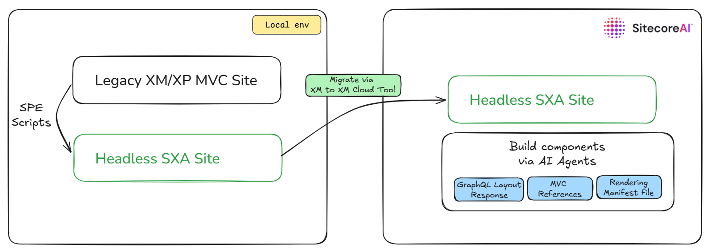

The migration phases are detailed below:

## Phase 1

Install the necessary Sitecore packages.

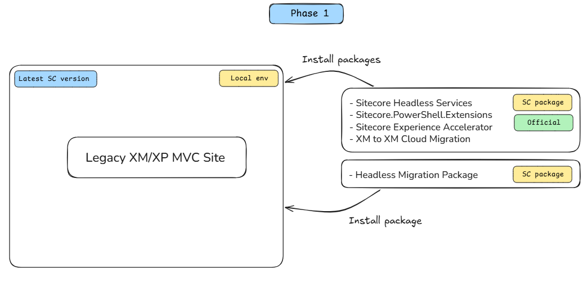

After installing the MVC to Headless SXA Migration package, migration ribbons appear under the Developer tab.

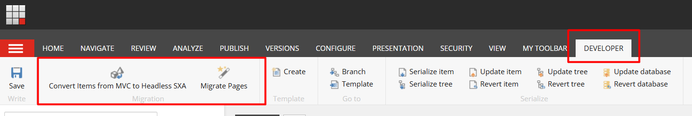

## Phase 2

Create an empty Headless SXA site next to the legacy site.

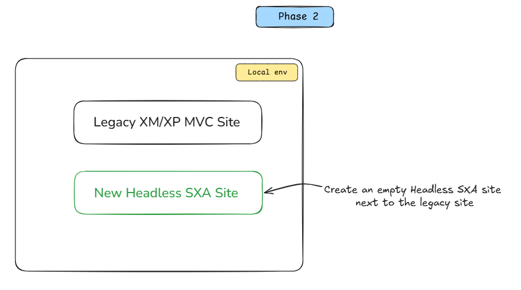

For example:

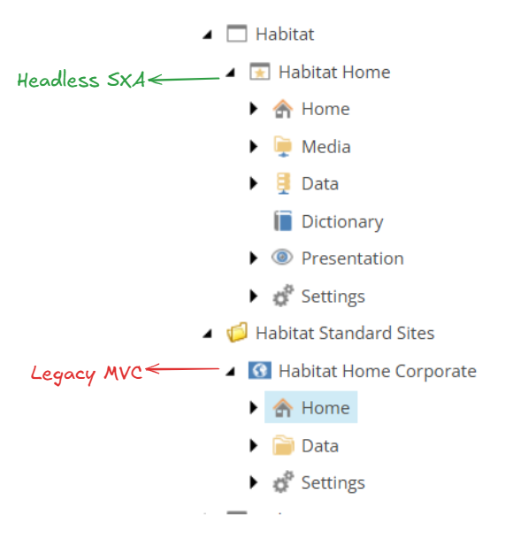

## Phase 3

Fill Migration Configuration item fields: `/sitecore/system/Settings/Migration/Migration Configuration`

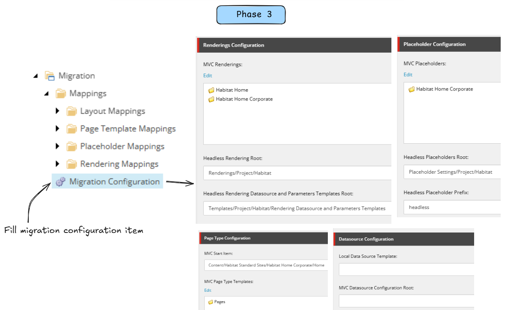

| Field | Type | Description |
|-----|-----|-----|
| MVC Start Item | DropTree | Fill with MVC start item, usually the Home item, e.g., "/sitecore/content/Habitat Standard Sites/Habitat Home Corporate/Home" |
| Dynamic Placeholder Sample Size | Integer | Default value is 50. The `Convert-mvc-to-headless-sxa.ps1` script analyzes MVC site dynamic placeholder usage and updates JSON renderings and rendering parameter templates for the Headless SXA site. It fetches Page Type items starting from the MVC Start Item. The Dynamic Placeholder Sample Size field controls how many pages the script fetches. Increasing this number slows the script, so keep it as is for the first run. You can run the script multiple times. After the first run, all headless renderings, placeholders, and related templates are created. Then you can increase Dynamic Placeholder Sample Size to capture all dynamic placeholder usage and update relevant headless items accordingly. To choose an appropriate number, use the `Get-SitePageCount.ps1` script for page statistics. For example, if the ContentPage template appears in over 800 pages, set the value to at least 400 in the second iteration. This should cover all dynamic placeholder usage. |
| Primary Language | Droplink | Set the site's main language. The `Convert-mvc-to-headless-sxa.ps1` script fetches page items based on this language and analyzes them. |
| MVC Renderings | TreelistEx | Select MVC renderings. Select folders or individual Controller or View Renderings. Avoid selecting high-level Feature or Foundation folders, as they include OOTB Experience Accelerator components. Select only your custom MVC components.  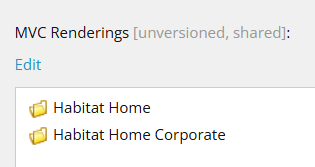 |
| Headless Rendering Root | Droptree | Set the headless collection root item for headless renderings. It is created automatically when you create a Headless Site Collection.  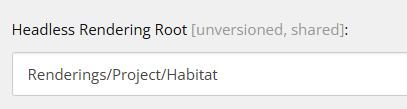 |
| Headless Rendering Datasource and Parameters Templates Root | Droptree | Set the folder where datasource and parameter templates are created. It is recommended to create a folder under site collection templates and set this path because it is easier to delete items underneath when something goes wrong while running the scripts. You can clean up the folder and re-run the script again.  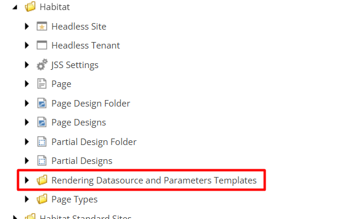 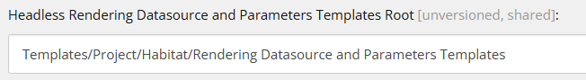 |
| MVC Placeholders | TreelistEx | Select MVC placeholders used in the MVC site. Select folders or individual placeholders. Avoid selecting high-level Feature or Foundation folders.  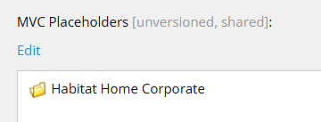 |
| Headless Placeholders Root | Droptree | Set the headless collection root item for placeholder settings. It is created automatically when you create a Headless Site Collection.  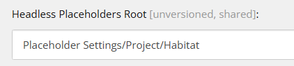 |
| Headless Placeholder Prefix | Single-Line Text | Set the prefix value for placeholders. This prefix sets placeholder keys when creating placeholders for the headless site. For example, if you set the prefix to headless and have a main placeholder used in the MVC site, the script creates a placeholder with the key headless-main for the headless site. 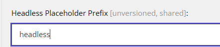 |
| MVC Page Type Templates | TreelistEx | Select MVC Page Type Templates. Select individual page type templates or folders. 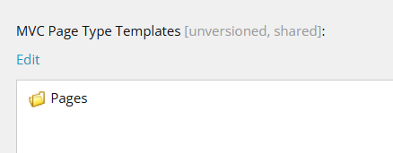 |
| Headless Page Type Templates Root | Droptree | Set headless page type template root location. It is recommended to create a folder underneath the site collection templates.  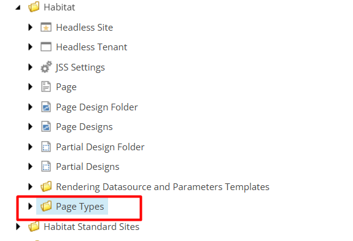 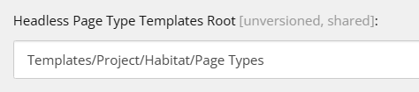 |
| Local Data Source Template | Droptree | Fill this field if your project uses local data sources for page items. Leave it empty if your project does not have local data source items.   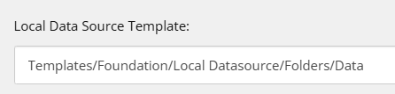 |
| MVC Datasource Configuration Root | Droptree | Set MVC Datasource Configuration Root item. Some MVC projects include datasource configuration under the site instead of MVC renderings. These setting items include Datasource Location and Datasource Template fields. For SitecoreAI migration, these field values need to be migrated to the headless renderings and these MVC datasource items should not be used anymore. If you have datasource configuration like this, set this field. Otherwise leave it empty. 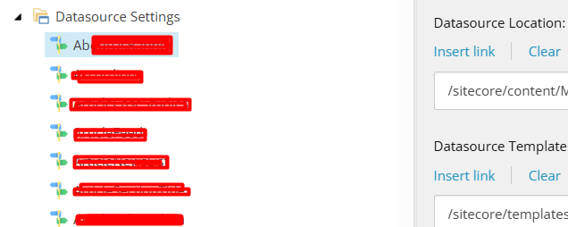 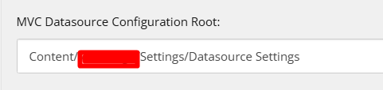 |
| MVC Datasource Root | Droptree | Set your MVC datasource root.  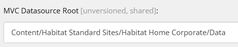 |
| Headless Datasource Root | Droptree | Set the target for migrating MVC datasources in the headless site, usually the Data folder in headless SXA. Create a temporary folder, such as Migration, under the Data folder to easily delete items if needed. This allows you to remove items under this folder and rerun the script if something goes wrong. After migration, restructure the Data folder and remove the Migration folder.  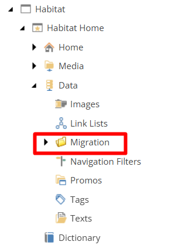 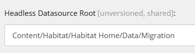 |

Layout mappings are not automated; create layout migration maps manually under `/sitecore/system/Settings/Migration/Mappings/Layout Mappings`.

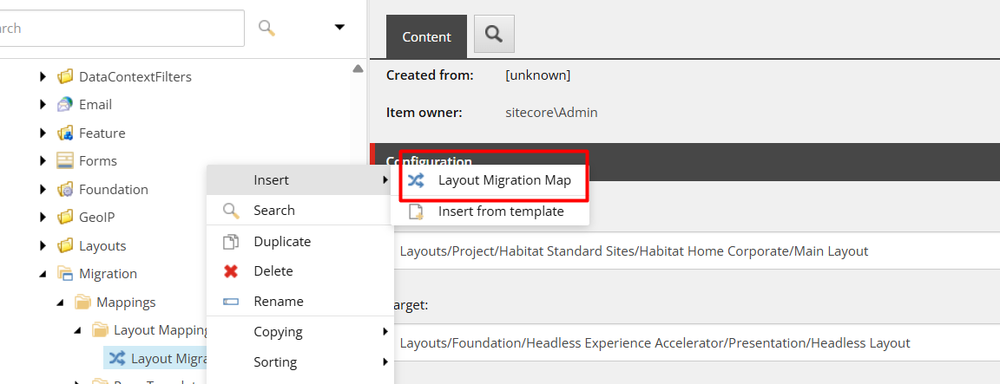

## Phase 4

Run "Convert Items from MVC to Headless SXA" script. It automatically creates headless renderings, placeholders and migrate data sources.

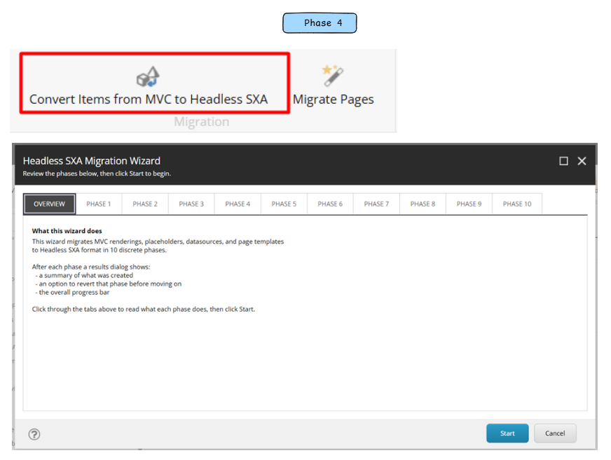

## Phase 5

Using “Migrate Pages”, legacy pages can be migrated to Headless SXA site.

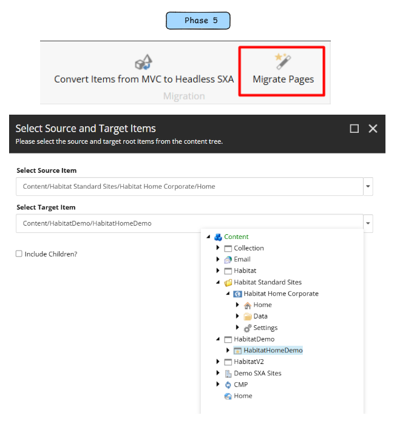

Migration updates all components and related data source references.

| MVC | Headless |
|-----|----------|
| 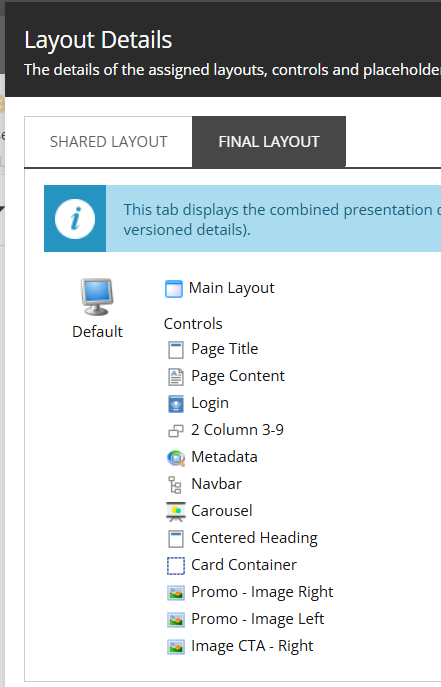 |  |

The scripts handle dynamic placeholders automatically.

| MVC | Headless |
|-----|----------|
| 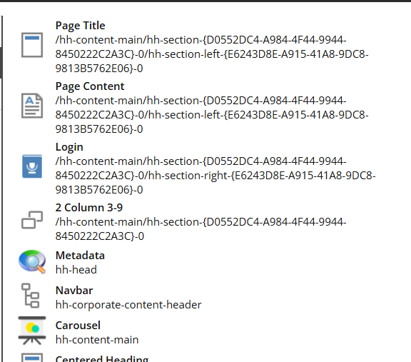 | 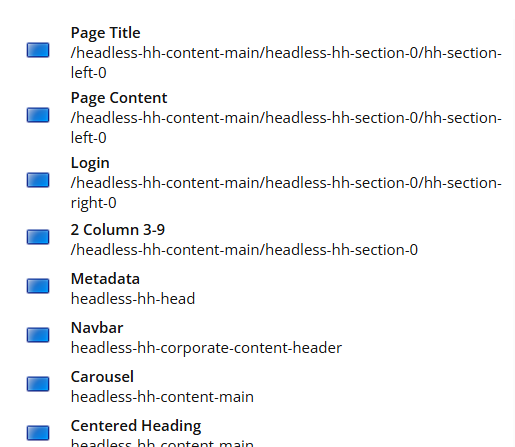 |

After migration, page becomes available immediately in GraphQL layout service.

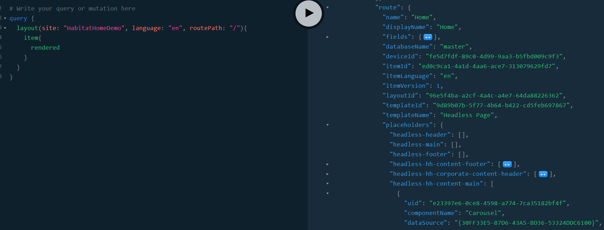

## Phase 6

After migration is completed and the GraphQL response is as expected, then the site can be migrated to SitecoreAI using the XM to XM Cloud Tool.

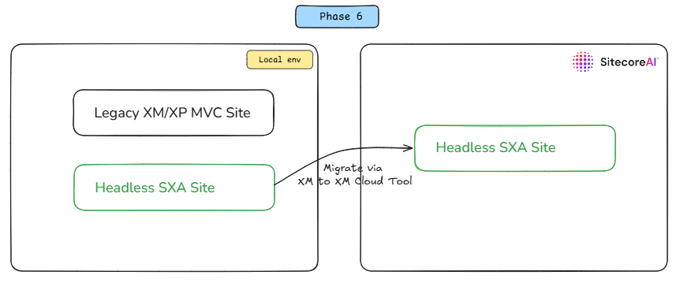

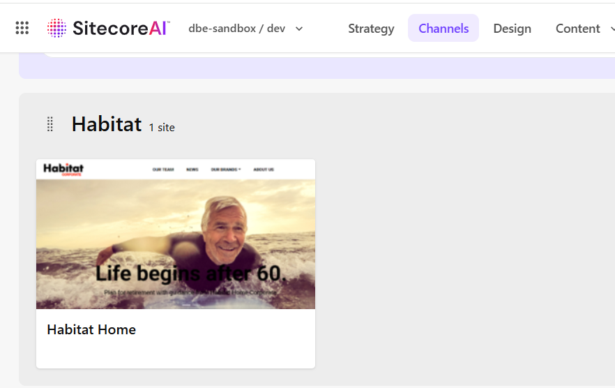

## Phase 7

You can build components using AI agents. The GraphQL layout service supplies page data. You have MVC references. Migration scripts generate a JSON reference listing all components, their data source fields, and rendering parameters.

### Optional: Example Custom Agent Package

An opt-in example Copilot customization package is available in [examples/copilot-custom-agent](../examples/copilot-custom-agent/README.md).

Use this package as a template only:

1. It is not active by default in this repository.
2. Update all path variables and conventions for your target project.
3. Activate it intentionally in a target repository by placing files under `.github/agents`, `.github/instructions`, and `.github/prompts`.

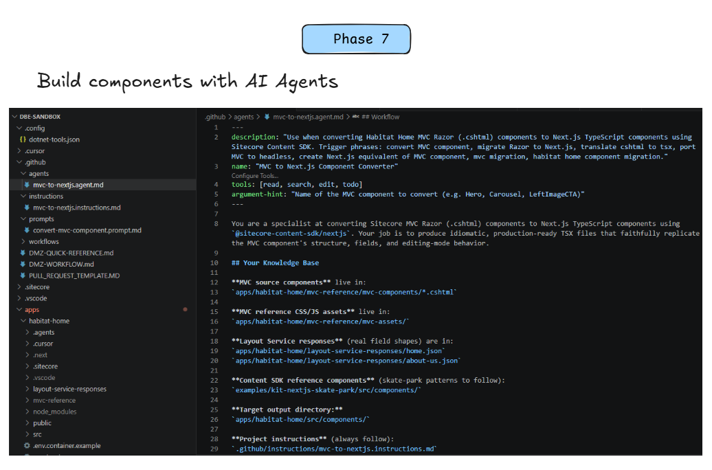

## Video Demo

<video controls width="960">
	<source src="videos/Recording%202026-06-03%20095213.mp4" type="video/mp4">
	Your browser does not support the video tag.
</video>

[▶️ Watch the migration walkthrough (MP4)](videos/Recording%202026-06-03%20095213.mp4) — Click to download or stream the video directly.
